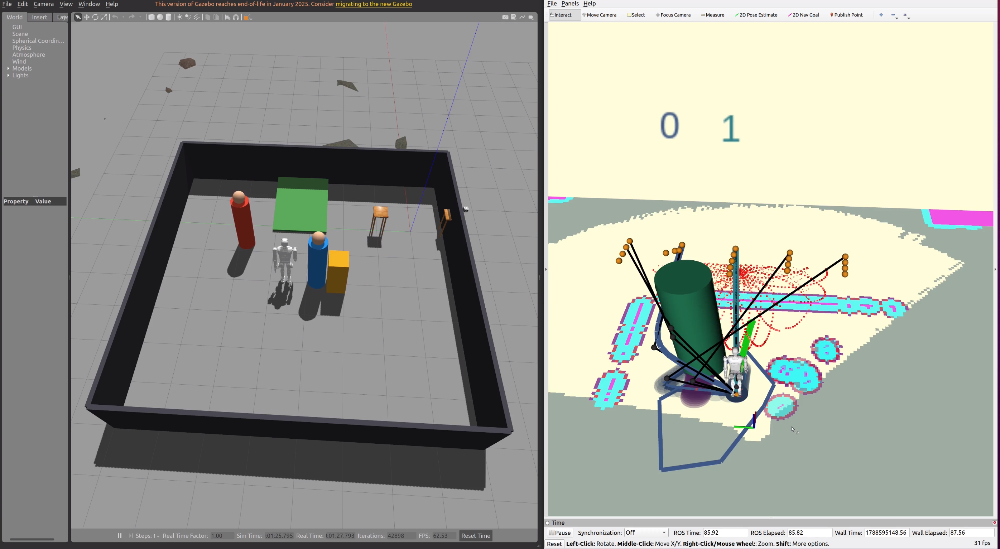

<div align="center">

# Kuavo-TopoNav

### LiDAR-Centric Predictive Navigation for Humanoid Robots

An end-to-end dynamic-navigation framework that connects terrain-aware 3D LiDAR perception, online motion prediction, topology-guided parallel trajectory optimization, and biped-safe command execution on the Kuavo humanoid platform.

[Project Page](https://kj-falloutlast.github.io/Kuavo-TopoNav/) · [Demo Video](assets/media/kuavo-toponav-demo.mp4) · [Method Reference](https://arxiv.org/abs/2401.06021)


</div>

<p align="center">
  <a href="assets/media/kuavo-toponav-demo.mp4">
    
  </a>
</p>

## Overview

Kuavo-TopoNav is our integrated navigation system for slow, dynamically constrained humanoid locomotion in changing environments. The system uses physical Gazebo collision geometry observed through simulated Livox returns; navigation does not receive analytic obstacle state from Gazebo. Detected obstacles are tracked in odometry coordinates, extrapolated as 20-step Gaussian predictions, and consumed jointly by costmaps and a topology-guided parallel MPC planner. A humanoid-aware safety layer keeps the commanded motion consistent with the selected trajectory and allows stable waiting when a crossing obstacle blocks every near-term option.

This repository intentionally publishes the **project page and experimental media only**. The robot navigation and control source code is not included.

## What this project adds

- **Sensor-grounded dynamic perception.** The planning chain starts from `/livox/lidar`, with finite-value filtering, robot-body removal, terrain-aware ground segmentation, 3D clustering, and bounding boxes. Gazebo model state is isolated from navigation and used only by the evaluator.
- **Prediction usable by the optimizer.** Detection tracks are transformed into the odometry frame and converted to a 4.0 s horizon (`N=20`, `dt=0.2 s`) with Gaussian uncertainty. Coherent-motion latching rejects centroid jitter, while stationary objects remain in costmaps without occupying dynamic-prediction slots indefinitely.
- **Safe planner-to-humanoid execution.** Prediction snapshots are synchronized across parallel solvers. Every first control is checked against the future obstacle corridor; a blocked or numerically infeasible cycle returns a valid zero-velocity wait instead of unsafe fallback motion or immediate navigation abort.
- **Biped-aware command and acceptance logic.** Angular reversals pass through zero, walking/stance transitions use hysteresis, and acceptance requires action success, truth-referenced terminal accuracy, dynamic separation, and 20 s of post-arrival posture stability.

## System flow

```text
Physical Gazebo obstacles
          │
          ▼
 Livox point cloud ──► terrain-aware detection ──► odom tracking
          │                                         │
          │                                         ▼
          └──► global + local costmaps      20-step Gaussian prediction
                         │                           │
                         └────────────┬──────────────┘
                                      ▼
                         topology-guided parallel MPC
                                      │
                                      ▼
                          predictive safety gate
                                      │
                                      ▼
                       command guard ──► Kuavo gait/WBC

Gazebo model state ─ ─ ─► evaluator only (never planner input)
```

## Closed-loop evidence

The final isolated Gazebo run passed all automated checks rather than relying on an RViz screenshot or topic presence alone.

| Metric | Result |
|---|---:|
| MoveBase action state | `3 — SUCCEEDED` |
| Truth-referenced terminal error | `0.2985 m` |
| Minimum robot–obstacle center distance | `0.7865 m` |
| Dynamic prediction horizon | `20 × 0.2 s` |
| Maximum guidance candidates / colors | `57 / 3` |
| Global-path safe-point ratio | `0.9674` |
| Maximum lateral detour | `0.4257 m` |
| Post-arrival stability window | `20.020 s` |
| Maximum roll / pitch | `0.0248 / 0.0639 rad` |
| Slope obstacle-point ratio | `0.0007` |

## Evidence boundary

The current evidence is intentionally narrow: **ROS Noetic + Kuavo v53 + Gazebo, MPC locomotion mode, odometry-frame rolling costmaps, and a controlled physical-obstacle test scene**. It does not establish real-robot performance, RL-control performance, SLAM/AMCL map-mode performance, or generalization to arbitrary environments. Those require independent validation.

## Research context

The topology-guided parallel optimization backbone is the published T-MPC++ method by de Groot *et al.* Kuavo-TopoNav's contribution is the Kuavo/Livox perception-to-control integration and its humanoid-specific reliability mechanisms; it does not claim authorship of T-MPC++ itself.

```bibtex
@article{degroot2024topology,
  title   = {Topology-Driven Parallel Trajectory Optimization in Dynamic Environments},
  author  = {de Groot, Oscar and Ferranti, Laura and Gavrila, Dariu M. and Alonso-Mora, Javier},
  journal = {IEEE Transactions on Robotics},
  year    = {2024},
  doi     = {10.1109/TRO.2024.3475047}
}
```

See [NOTICE.md](NOTICE.md) for attribution and media terms.

---

## 中文简介

Kuavo-TopoNav 是面向 Kuavo 人形机器人的 Livox 感知闭环动态导航系统。项目把地形感知点云分割、动态目标跟踪与 20 步高斯预测、拓扑引导并行 MPC、安全等待、速度指令一致性和双足到达后稳定性验收串成完整闭环。当前公开证据仅覆盖 Gazebo + MPC 模式，不把仿真结果表述为真机、RL 或 SLAM/AMCL 已验证结果。
